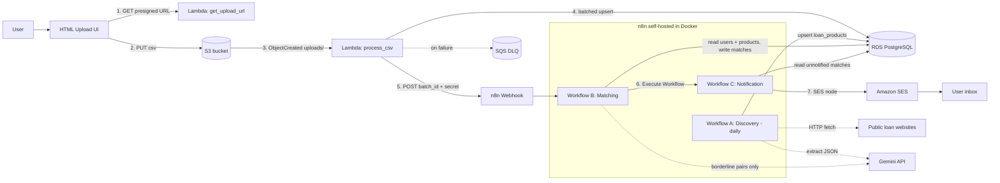
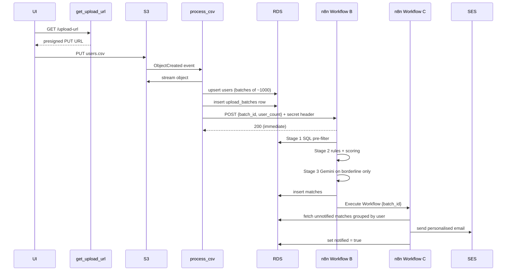
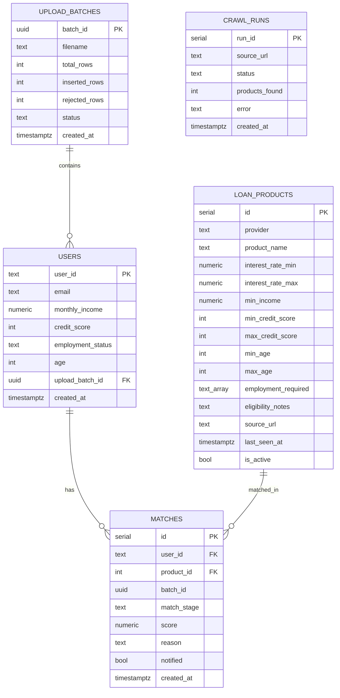
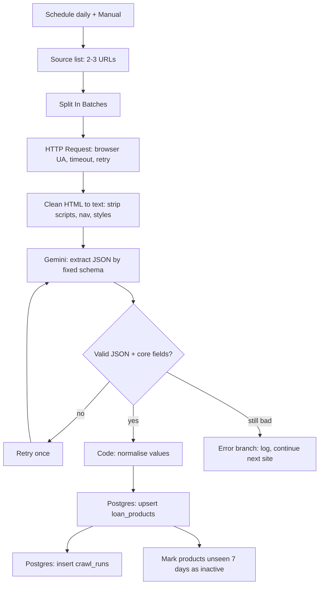
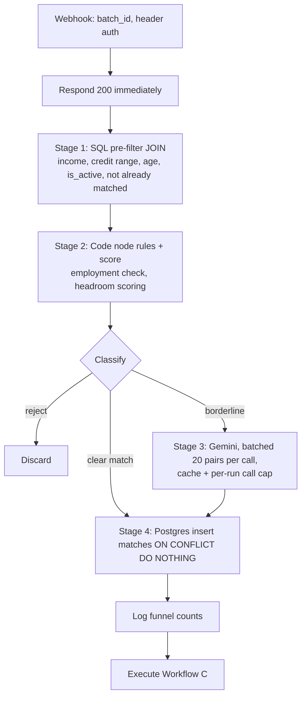
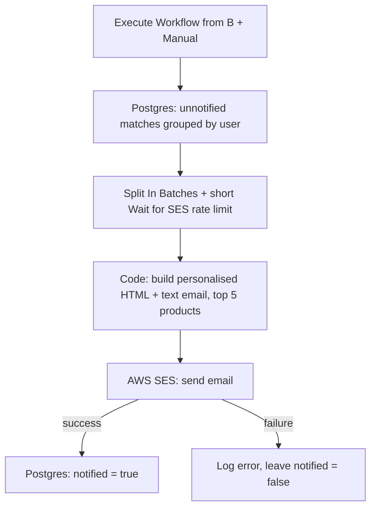
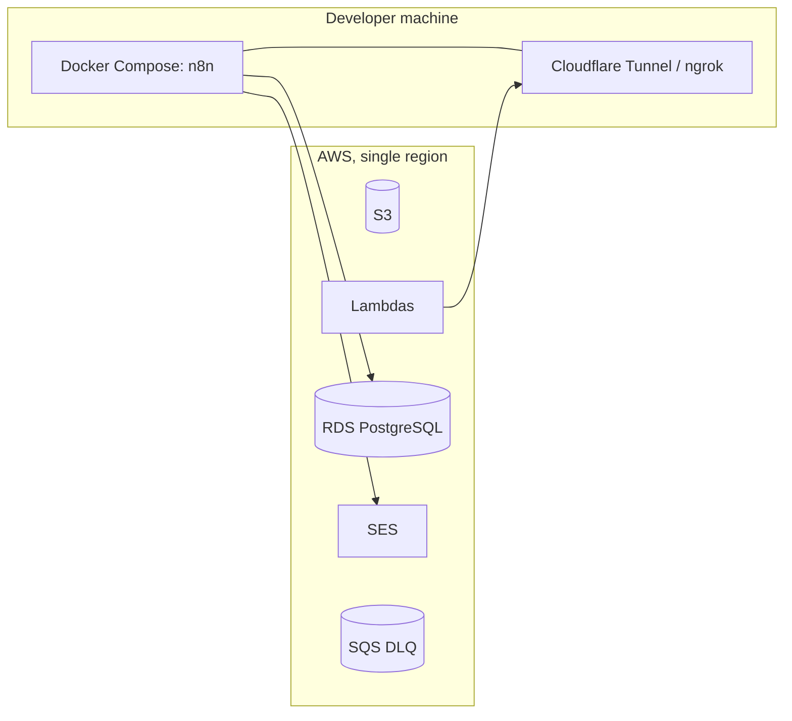

# ARCHITECTURE.md

Technical design of the Loan Eligibility Engine. This is the source of truth for table names, flows and component responsibilities.

---

## 1. Goals and principles

- **Event-driven ingestion:** the browser uploads straight to S3, so file size never hits API Gateway or Lambda payload limits.
- **Business logic in n8n:** crawling, matching and notification are n8n workflows. Lambda only ingests.
- **Cheap by design:** most work is done in SQL; the LLM sees only a small fraction of pairs.
- **Idempotent everywhere:** re-running any step never duplicates data or emails.
- **Free tier only.**

---

## 1.1 Ownership and interface contract

The project is built on two parallel tracks that meet at a small, fixed contract.

| Track | Owner | Contents |
|---|---|---|
| Code track | AI coding agent (Antigravity) | SQL schema and seeds, `serverless.yml`, `get_upload_url`, `process_csv`, `common/` helpers, frontend, `docker-compose.yml`, tests, README skeleton |
| n8n track | Developer (human), built by hand in the n8n editor | Workflows A, B, C, n8n credentials, exported workflow JSON in `n8n/workflows/` |

**Contract (do not change without updating both sides)**

- **Tables and columns:** as defined in section 5.
- **Webhook:** `POST {N8N_WEBHOOK_URL}` (path `/webhook/loan-batch`), header `X-Webhook-Secret`, JSON body:
  ```json
  { "batch_id": "uuid", "user_count": 123, "rejected_count": 2, "filename": "uploads/...csv" }
  ```
  n8n replies HTTP 200 immediately and processes afterwards.
- **`upload_batches.status`:** `processing`, `ingested`, `failed`, `webhook_failed` (set by Lambda); `matched`, `notified` (may be set by n8n).
- **Seed data:** `sql/seed_loan_products.sql` and `sql/seed_test_users.sql` let the n8n track be built and tested before the Lambdas work.

---

## 2. System diagram



Network note: Lambda reaches n8n through a public tunnel (Cloudflare Tunnel or ngrok) because n8n runs on a local machine. n8n reaches RDS directly over the public endpoint with SSL.

---

## 3. Components

| Component | Type | Responsibility |
|---|---|---|
| `frontend/index.html` | Static page | Pick CSV, request presigned URL, PUT to S3, show status |
| `get_upload_url` | Lambda (Function URL) | Return short-lived presigned PUT URL for `uploads/<timestamp>-<uuid>.csv` |
| S3 bucket | Storage | Holds `uploads/` (incoming) and `rejected/` (bad rows). Private, CORS for PUT |
| `process_csv` | Lambda (S3 trigger) | Stream, validate, normalise, batch-upsert users, record batch, call n8n webhook |
| RDS PostgreSQL | Database | System of record for all tables |
| Workflow A | n8n | Daily crawl of 2-3 sites, LLM extraction, upsert `loan_products` |
| Workflow B | n8n | Webhook-triggered multi-stage matching, writes `matches` |
| Workflow C | n8n | Per-user email through SES, marks matches notified |
| SES | AWS | Sends email (sandbox: verified recipients only) |
| SQS DLQ | AWS | Captures failed `process_csv` events |
| SSM / env vars | Config | DB credentials, webhook secret |

---

## 4. Data flow (sequence)



---

## 5. Data model



**Constraints and indexes**
- `loan_products`: `UNIQUE (provider, product_name)`
- `matches`: `UNIQUE (user_id, product_id)`
- Indexes: `users(upload_batch_id)`, `users(credit_score, monthly_income)`, `matches(notified)`, `loan_products(is_active)`

`employment_status` is normalised to: `salaried`, `self_employed`, `unemployed`, `student`, `other`.

---

## 6. Component design details

### 6.1 Ingestion

- **Presigned upload:** removes the Lambda/API Gateway payload limit; the client talks to S3 directly.
- **Streaming parse:** `csv.DictReader` over the S3 body; memory use stays flat for large files.
- **Validation:** required fields, email format, numeric fields numeric, credit score 300-900, age 18-100. Invalid rows are counted and written to `rejected/<batch_id>.csv`.
- **Batch upsert:** `execute_values` with `ON CONFLICT (user_id) DO UPDATE`.
- **Hand-off:** after commit, POST `{batch_id, user_count}` to the n8n webhook with header `X-Webhook-Secret`, timeout 10s, 3 retries with backoff. If it still fails, mark the batch `webhook_failed` so it can be replayed.
- **Limits:** timeout 300s, memory 512 MB. For files too large for one invocation, the documented extension is chunked processing or Postgres `COPY`.

### 6.2 Workflow A: Loan Product Discovery



- **Layout resilience:** extraction is LLM-on-text with a fixed JSON schema, not CSS selectors.
- **Fallback:** `seed_loan_products.sql` guarantees demo data if a site blocks the crawler.
- **Etiquette:** low volume, once daily, respect robots.txt and terms.

### 6.3 Workflow B: Matching (Optimization Treasure Hunt)



| Stage | Where | Purpose | Cost |
|---|---|---|---|
| 0 | SQL | Scope to the batch and active products, skip existing matches | Free |
| 1 | PostgreSQL | One set-based JOIN removes most of the user x product pairs | Free, ms |
| 2 | n8n Code node | Employment rules, scoring, classify clear / borderline / reject | Free |
| 3 | Gemini | Only borderline pairs: thresholds within about 5%, or free-text eligibility rules that code cannot parse. Strict JSON output `{user_id, product_id, eligible, reason}` | Small |
| 4 | PostgreSQL | Bulk insert with stage, score, reason | Free |

**Funnel logging:** record pair counts at each stage (e.g. total pairs → after SQL → after rules → sent to LLM → final matches). These numbers go into the README and video.

**Key optimizations:** set-based SQL instead of per-user loops; LLM calls batched; results cached by (product, profile bucket); hard cap on LLM calls per run; skip pairs already matched.

### 6.4 Workflow C: Notification



- **Idempotency:** only `notified = false` rows are selected, so reruns never duplicate emails.
- **Email contents:** greeting, list of matched products with interest rate and why they matched, disclaimer that eligibility is indicative.
- **Sandbox:** SES only delivers to verified addresses; demo data must include verified emails.

---

## 7. Security design

| Area | Control |
|---|---|
| S3 | Public access blocked; only short-lived presigned PUT URLs; CORS limited to the UI origin |
| IAM | Lambda role scoped to the one bucket, SSM params, SQS DLQ, logs. Separate n8n IAM user with only `ses:SendEmail` |
| Webhook | Shared-secret header (`X-Webhook-Secret`) checked in n8n |
| Database | SSL required, strong password, security group restricted where possible. Public RDS is a conscious free-tier trade-off (no NAT Gateway cost) |
| n8n | Basic auth enabled, `N8N_ENCRYPTION_KEY` set, credentials stored in n8n credential store |
| Repo | `.env` gitignored, `.env.example` placeholders, workflow JSON exported without secrets |
| Logging | No full emails or user rows in logs |

---

## 8. Failure handling

| Failure | Behaviour |
|---|---|
| Invalid CSV row | Counted, written to `rejected/`, ingestion continues |
| `process_csv` crash | Lambda retry then SQS DLQ; batch status `failed` |
| n8n unreachable | Lambda retries 3x, then batch marked `webhook_failed` for replay |
| Crawl site down or blocked | Error branch logs to `crawl_runs`, other sites continue, seed data still available |
| Gemini bad JSON or rate limit | One retry with wait, then skip item and log |
| SES send error | `notified` stays false, error logged, safe to rerun Workflow C |
| Duplicate upload | Upserts and unique constraints prevent duplicates |

---

## 9. Deployment view



- AWS stack deployed with `serverless deploy`.
- n8n launched with `docker compose up -d`; `WEBHOOK_URL` is set to the tunnel URL.
- RDS and SES are created manually in the console (RDS before deploy; SES identities verified before the demo).

---

## 10. Design decisions and trade-offs

| Decision | Reason | Trade-off |
|---|---|---|
| Presigned S3 upload + S3 event | Handles large files, async, no API size limits | Slightly more moving parts than a single endpoint |
| Lambda Function URL instead of API Gateway | Free and simpler; API Gateway is optional per brief | Fewer built-in features (throttling, keys) |
| Lambdas outside VPC, public RDS | Avoids NAT Gateway cost | Weaker network isolation; mitigated with SSL and strong credentials |
| LLM-on-text crawling | Survives layout changes | Needs validation and retries for bad JSON |
| Multi-stage matching funnel | Cuts LLM usage to a small fraction of pairs | More logic to explain, but it is the core optimization story |
| n8n on a laptop + tunnel | Free, matches assignment | Demo depends on the tunnel and machine being on |
| `notified` flag | Safe reruns, no duplicate emails | Needs a status column and query discipline |

---

## 11. Possible extensions (mention in README, do not build)

- SQS between `process_csv` and n8n for stronger decoupling
- Postgres `COPY` or Step Functions for very large CSVs
- Hosting n8n on a small EC2 instance with a fixed domain
- Moving credentials to AWS Secrets Manager
- SES production access and unsubscribe handling
