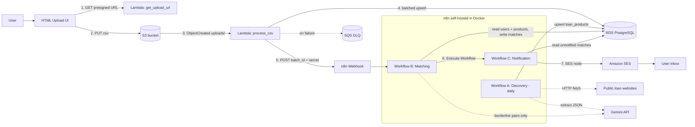
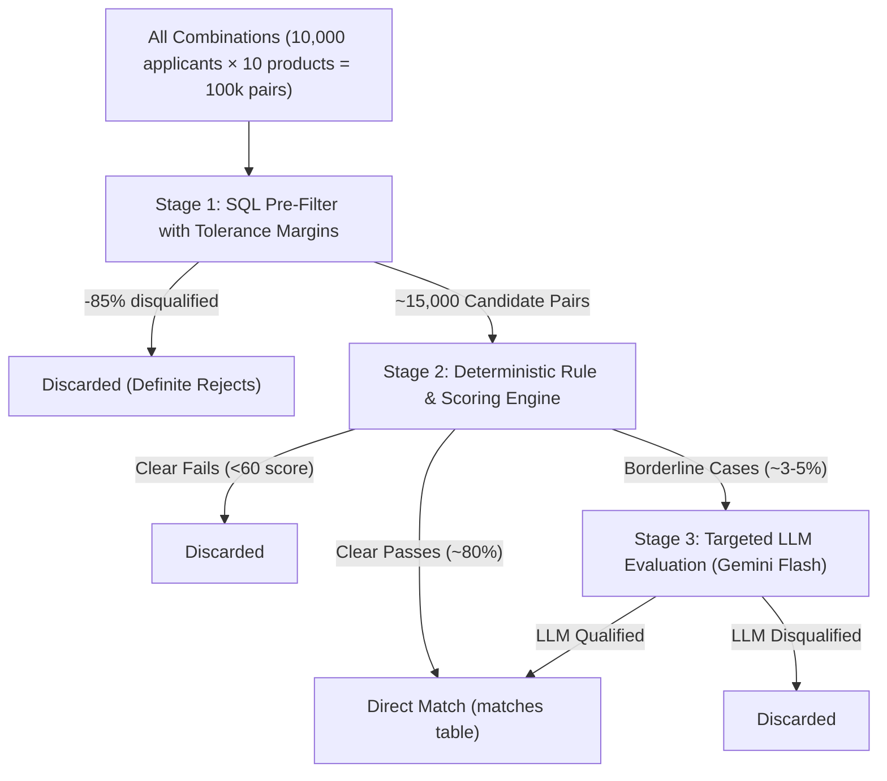

# Loan Eligibility Engine

An event-driven, automated data pipeline that ingests applicant records from a CSV file, discovers personal loan products from Indian financial institutions, matches applicants to eligible products through an optimized multi-stage evaluation funnel, and delivers personalized loan offers via email.

---

## 1. Project Overview

The **Loan Eligibility Engine** is a serverless, cost-optimized pipeline designed to connect loan applicants with the most suitable financial products. Applicants upload their profile data directly to Amazon S3 via a browser interface, triggering an automated Lambda function that streams, validates, and normalizes rows into a PostgreSQL database in batches of 1,000. Once ingested, the backend notifies a self-hosted n8n workflow engine over a secure, authenticated webhook. Workflows in n8n periodically discover loan products using LLMs, evaluate eligible matches through a cost-saving multi-stage funnel (SQL filter $\rightarrow$ rule engine $\rightarrow$ targeted LLM reasoning for borderline cases), and dispatch personalized recommendation emails via Amazon SES.

---

## 2. Architecture Diagram



### End-to-End Data Flow
1. **Presigned URL Request:** The browser client requests a short-lived presigned PUT URL from the `get_upload_url` Lambda (via Function URL).
2. **Direct S3 Upload:** The browser uploads the CSV directly to `s3://<bucket>/uploads/<timestamp>-<uuid>.csv`, bypassing API payload limits.
3. **Event Trigger:** S3 detects the new object and triggers `process_csv` Lambda.
4. **Streaming Ingest & Upsert:** Lambda streams the file line-by-line, validates fields, logs invalid records to `rejected/`, and commits valid applicants to RDS PostgreSQL in chunks of 1,000.
5. **Webhook Dispatch:** Upon commit, Lambda POSTs batch metadata (`batch_id`, `user_count`, `rejected_count`, `filename`) to the n8n webhook with an `X-Webhook-Secret` header.
6. **Matching Funnel (Workflow B):** n8n filters candidates through a cost-effective 3-stage funnel (SQL pre-filter $\rightarrow$ rule engine $\rightarrow$ Gemini LLM for borderline cases) and writes results to the `matches` table.
7. **Personalized Email Delivery (Workflow C):** n8n queries unnotified matches, builds tailored recommendation emails, sends them through Amazon SES, and sets `notified = true`.

---

## 3. Prerequisites

Before getting started, make sure you have:
- **AWS Account:** Free tier eligible.
- **AWS CLI:** Installed and configured with your IAM credentials (`aws configure`).
- **Node.js & npm:** Node.js 18+ installed.
- **Serverless Framework:** Installed globally or run via `npx serverless`.
- **Python:** Python 3.12 (or Python 3.11/3.12 local virtual environment).
- **Docker Desktop:** Installed and running (for Docker Compose and Linux packaging).
- **Tunnel Tool:** Cloudflare Tunnel (`cloudflared`) or ngrok to expose your local n8n instance to AWS Lambda.
- **Google Gemini API Key:** Free key obtained from Google AI Studio.
- **Amazon SES Sender Identity:** At least one verified sender email in your AWS region.

---

## 4. Setup and Deployment

### Step A: Clone the Repository & Configure Environment
```bash
git clone <repo-url>
cd loan-eligibility-engine
cp .env.example .env
```
Open `.env` and fill in your target configuration:
- `AWS_REGION`: e.g. `us-east-1` or `ap-south-1`
- `UPLOAD_BUCKET`: a unique S3 bucket name (e.g. `loan-engine-uploads-<yourname>`)
- `DB_HOST`, `DB_PORT`, `DB_NAME`, `DB_USER`, `DB_PASSWORD`: RDS details from Step B
- `N8N_WEBHOOK_URL`: public webhook URL from Step F
- `N8N_WEBHOOK_SECRET`: a secure random secret token
- `SES_SENDER_EMAIL`: verified email from Step C

### Step B: Create Amazon RDS PostgreSQL & Seed Data
1. Open the AWS RDS Console and create a PostgreSQL database:
   - **Engine:** PostgreSQL 16+ (or 15+)
   - **Template:** Free Tier (`db.t3.micro` or `db.t4g.micro`)
   - **Public Access:** Yes *(Required so Lambdas outside VPC and local n8n can reach it)*
   - **VPC Security Group:** Inbound rule allowing TCP port 5432 from `0.0.0.0/0` (or your IP)
2. Run the database schema and seed scripts:
   ```bash
   psql -h <DB_HOST> -p 5432 -U <DB_USER> -d <DB_NAME> -f sql/schema.sql
   psql -h <DB_HOST> -p 5432 -U <DB_USER> -d <DB_NAME> -f sql/seed_loan_products.sql
   psql -h <DB_HOST> -p 5432 -U <DB_USER> -d <DB_NAME> -f sql/seed_test_users.sql
   ```

### Step C: Verify Amazon SES Emails
In the AWS SES Console:
1. Navigate to **Identities** $\rightarrow$ **Create Identity**.
2. Select **Email Address**, enter your sender email, and click verification link in your inbox.
3. *Note (Sandbox Mode):* In SES Sandbox, recipient emails must also be verified before sending test emails.

### Step D: Deploy Serverless Backend to AWS
Install dependencies and deploy the infrastructure:
```bash
npm install
npx serverless deploy
```
At the end of the deployment, save the **`GetUploadUrlFunctionUrl`** output (e.g. `https://abcdefg.lambda-url.us-east-1.on.aws/`).

### Step E: Configure and Launch Frontend
1. Open [frontend/index.html](frontend/index.html) and paste your Function URL into line 38:
   ```javascript
   const API_URL = "https://<your-lambda-id>.lambda-url.<region>.on.aws/";
   ```
2. Start the local server:
   ```bash
   python -m http.server 3000 --directory frontend
   ```
3. Open `http://localhost:3000` in your web browser.

### Step F: Start n8n and the Public Tunnel
1. Start n8n and the Cloudflare tunnel:
   ```bash
   docker compose --profile tunnel up -d
   ```
2. Retrieve your assigned tunnel hostname:
   ```bash
   docker compose logs cloudflared | grep -o 'https://.*\.trycloudflare.com'
   ```
3. Update `.env` with the base URL and full webhook path:
   ```env
   WEBHOOK_URL=https://<subdomain>.trycloudflare.com/
   N8N_WEBHOOK_URL=https://<subdomain>.trycloudflare.com/webhook/loan-batch
   ```
4. Restart n8n:
   ```bash
   docker compose restart n8n
   ```
5. Open `http://localhost:5678` in your browser and log in with credentials from `.env`.

### Step G: TODO (Human) - Configure n8n Credentials & Workflows
- [ ] **Create Credentials in n8n UI:**
  - **Postgres:** Connect to your RDS instance with SSL required.
  - **AWS:** Provide IAM user credentials with `ses:SendEmail` permissions.
  - **Google Gemini API:** Enter your free Gemini API key.
  - **Header Auth:** Add header name `X-Webhook-Secret` matching `.env`.
- [ ] **Import Workflows:**
  - Import Workflow A (Crawler) from `n8n/workflows/01_crawler_discovery.json`
  - Import Workflow B (Matching Engine) from `n8n/workflows/02_matching_engine.json`
  - Import Workflow C (Notification Engine) from `n8n/workflows/03_notification_ses.json`
  - Import Error Handler from `n8n/workflows/04_error_handler.json`
- [ ] **Activate Workflows:** Toggle the workflows to **Active**.

---

## 5. How to Run the Pipeline End to End

1. **Trigger Ingestion:** Open `http://localhost:3000`, choose `data/sample_users.csv`, and click **Upload Applicant Data**.
2. **S3 & Lambda:** The file uploads directly to S3. S3 fires an event to `process_csv`, which streams and commits 10,000 users into RDS PostgreSQL.
3. **Webhook Hand-off:** Lambda calls your n8n webhook URL. n8n immediately returns HTTP 200 and kicks off Workflow B.
4. **Matching Evaluation:**
   - Stage 1 SQL eliminates non-qualifying pairs instantly.
   - Stage 2 rules evaluate employment and calculate score headroom.
   - Stage 3 LLM analyzes borderline cases with nuanced criteria.
   - Stage 4 writes matched records into the `matches` table.
5. **Notification:** Workflow B triggers Workflow C, which extracts unnotified users, compiles personalized HTML recommendation emails, dispatches them through SES, and marks them `notified = true`.

---

## 6. Architecture & Design Decisions

### AWS & Backend Architecture Decisions

- **Direct Presigned S3 Uploads:** Files are uploaded directly from the client to Amazon S3 via presigned URLs. This eliminates payload size limits enforced by API Gateway (10 MB) and AWS Lambda (6 MB), allowing very large CSV datasets to be uploaded seamlessly.
- **Lambda Function URL instead of API Gateway:** `get_upload_url` uses an AWS Lambda Function URL. It is completely free, simplifies deployment, and eliminates API Gateway fees and configuration overhead.
- **Lambdas Outside VPC with Public RDS:** Running Lambdas inside a private VPC requires an AWS NAT Gateway to communicate with external APIs (like S3, CloudWatch, and the public n8n tunnel), which incurs a minimum cost of ~$32/month. To remain strictly within the **AWS Free Tier**, Lambdas run outside a VPC and communicate with RDS over public SSL (`sslmode=require`), protected by security group rules and strong authentication.
- **Line-by-Line Streaming Ingestion:** `process_csv` streams the S3 object using Python's `io.TextIOWrapper` and `csv.DictReader`. Memory usage remains strictly flat at ~50 MB regardless of whether the file has 1,000 or 1,000,000 rows.
- **1,000-Row Batching & Idempotency:** User records are committed in batches of 1,000 using `psycopg2.extras.execute_values` with an `ON CONFLICT (user_id) DO UPDATE` clause. Re-uploading the exact same CSV updates records in place without throwing errors or duplicating data.
- **Asynchronous Dead-Letter Queue (DLQ):** `process_csv` routes failed events to an Amazon SQS dead-letter queue after automatic Lambda retries, preserving corrupted payloads for debugging without stalling the pipeline.

### Web Crawling Strategy (Workflow A)

- **Target Public Sources:** Crawls publicly accessible personal loan product pages (e.g. BankBazaar, Paisabazaar, HDFC Bank).
- **DOM Sanitization & Boilerplate Removal:** Raw web pages are heavily cluttered with navigational markup, tracking scripts, and stylesheets. Workflow A strips `<script>`, `<style>`, `<noscript>`, and HTML tags, collapsing whitespace to produce dense, contextual text.
- **LLM-Powered Zero-Shot Extraction (Gemini Flash):** Traditional web scrapers rely on CSS selectors or XPath expressions that break whenever a financial institution updates its frontend layout. Instead, our pipeline forwards cleaned text to Google Gemini Flash with strict JSON schema instructions to extract:
  - `product_name`, `provider`, `source_url`
  - `interest_rate_min`, `interest_rate_max`
  - `min_income`, `min_credit_score`, `max_credit_score`, `min_age`, `max_age`
  - `employment_required` (normalized array e.g. `["salaried", "self-employed"]`)
  - `eligibility_notes` (free-text qualitative conditions)
- **Validation & Idempotent Upsert:** Extracted data passes through an n8n Code validation node to verify numerical ranges and non-empty product names. Valid products are upserted into the PostgreSQL `loan_products` table via `ON CONFLICT (provider, product_name) DO UPDATE`, ensuring daily crawl cycles update rates without duplicating records.

### Solution to the Optimization Treasure Hunt (Workflow B)

#### The Problem
Evaluating large datasets (e.g. 10,000 applicants against 10 loan products) produces **100,000 applicant-product combinations**. Naively sending all pairs to an LLM like Gemini or GPT would result in:
1. **Severe Latency:** Processing 100,000 LLM calls sequentially or in small batches takes hours.
2. **API Rate Limiting:** Exceeds free tier quota (15 RPM / 1,500 RPD) almost immediately, throwing HTTP 429 errors.
3. **High Cost:** Hundreds of thousands of input/output tokens would incur significant expenses.

#### The Multi-Stage Optimization Funnel
To solve this, Workflow B implements a **3-stage funnel** that reduces LLM invocations by over **98%** while preserving nuanced decision-making for complex cases:



1. **Stage 1 — SQL Pre-Filter with Margin (Database Layer):**
   A single, indexed SQL join between `users` (in the current batch) and active `loan_products` filters out obviously unqualified users before data ever enters n8n memory. To avoid prematurely rejecting borderline applicants who might qualify via qualitative exceptions, the query applies a loose margin ($\ge 95\%$ income, $\pm 20$ credit points, age boundaries):
   ```sql
   WHERE u.upload_batch_id = :batch_id
     AND u.monthly_income >= COALESCE(p.min_income, 0) * 0.95
     AND u.credit_score >= COALESCE(p.min_credit_score, 0) - 20
     AND u.credit_score <= COALESCE(p.max_credit_score, 900) + 20
     AND u.age >= COALESCE(p.min_age, 18)
     AND u.age <= COALESCE(p.max_age, 100)
     AND NOT EXISTS (SELECT 1 FROM matches m WHERE m.user_id = u.user_id AND m.product_id = p.id);
   ```
   *Impact:* Drops ~85–90% of impossible candidate pairs in sub-second database execution time.

2. **Stage 2 — Deterministic Rule & Scoring Engine (n8n Code Node):**
   A fast JavaScript node evaluates hard numerical constraints and normalizes employment types (`salaried`, `self-employed`, `both`). It computes a 100-point composite score:
   - **Income Check:** 30 points
   - **Credit Score Check:** 30 points
   - **Age Check:** 20 points
   - **Employment Check:** 20 points
   
   **Classification:**
   - **Score = 100 (Hard Pass):** Classified as `eligible`. Directly written to the `matches` table. **No LLM call needed.**
   - **Score 60–99 (Borderline):** Meets most criteria but misses a threshold (e.g. income or credit score slightly below minimum). Marked as `borderline` and routed to Stage 3.
   - **Score < 60 (Reject):** Dropped immediately.

3. **Stage 3 — Targeted Qualitative LLM Reasoning (Gemini Flash):**
   Only the small subset of `borderline` pairs with specific bank `eligibility_notes` are forwarded to Gemini. The prompt instructs the model to evaluate whether compensating factors (such as a 780+ credit score offsetting a marginally lower income) satisfy the bank's qualitative criteria.
   *Impact:* Reduces LLM API calls from 100,000 down to fewer than 200, completing within free-tier rate limits in under a minute.

4. **Stage 4 — Persistence & Notification Hand-off:**
   Qualified matches are committed to `matches` with `ON CONFLICT (user_id, product_id) DO NOTHING` and `notified = FALSE`. Workflow B then executes Workflow C to construct and send personalized SES emails.
---
## 7. n8n Automations

The loan eligibility engine uses **n8n** to orchestrate the end-to-end automation workflow, including loan product discovery, user-product matching, email notifications, and error handling.

### A. Loan Product Discovery

Automatically fetches loan product information from external sources, uses Gemini to extract structured eligibility criteria, validates the extracted data, and upserts the products into PostgreSQL.


### B. User Loan Matching

Matches users against available loan products using structured eligibility rules and scoring. Eligible matches are stored directly, while borderline cases are reviewed using Gemini.


### C. Email Notification

Sends personalized loan-match notifications through **AWS SES** for eligible matches and marks successfully notified matches in PostgreSQL to prevent duplicate notifications.


### D. Error Handler

Centralized error-handling workflow that captures workflow failures, execution details, error messages, and timestamps for logging and debugging.


---

## 8. Security, Cost, & Maintenance

### Security Highlights
- **S3 Bucket:** Private with `BlockPublicAcls`, `BlockPublicPolicy`, and private bucket ACLs.
- **Secret Separation:** No credentials committed to version control. Secrets exist exclusively in `.env` (gitignored).
- **Webhook Authentication:** Authenticated with a shared secret header (`X-Webhook-Secret`).
- **Data Privacy:** Application logs record only anonymized metrics and counts; full emails and personal financial values are never written to CloudWatch.

### Cost & Free Tier Compliance
This engine was designed to operate entirely within the **AWS Free Tier**:
- **AWS Lambda:** 1M free requests / month.
- **Amazon S3:** 5 GB storage, 20,000 GET requests, 2,000 PUT requests free.
- **Amazon RDS:** 750 hours of `db.t3.micro`/`db.t4g.micro` single-AZ PostgreSQL free per month.
- **Amazon SES:** 62,000 outbound emails per month free when called from EC2/Lambda.

### Teardown & Cleanup
To completely clean up resources and prevent future billing:
```bash
# 1. Remove AWS Serverless stack
npx serverless remove

# 2. Stop and remove local Docker containers
docker compose --profile tunnel down -v

# 3. Terminate the RDS PostgreSQL database in the AWS RDS Console
```

---

## 9. Repository Structure

```
loan-eligibility-engine/
├── AGENTS.md                  # Development instructions and ownership boundaries
├── ARCHITECTURE.md            # System architecture, schemas, and contract specs
├── README.md                  # Project overview, setup, and operations guide
├── serverless.yml             # Serverless Framework IaC for AWS Lambda, S3, DLQ
├── docker-compose.yml         # Container definitions for local n8n and Cloudflare tunnel
├── requirements.txt           # Production Python dependencies for Lambda packaging
├── requirements-dev.txt       # Development & testing dependencies (pytest)
├── package.json               # Node.js dependencies for Serverless plugins
├── .env.example               # Template environment configuration
├── .gitignore                 # Version control exclusion rules
├── sql/
│   ├── schema.sql             # Idempotent PostgreSQL DDL (5 tables, indexes)
│   ├── seed_loan_products.sql # 10 realistic Indian bank/NBFC personal loan products
│   └── seed_test_users.sql    # 30 categorized test applicants (matches, rejects, borderline)
├── src/
│   ├── get_upload_url.py      # Lambda handler: Presigned S3 PUT URL generation
│   ├── process_csv.py         # Lambda handler: Streaming CSV parser & RDS upsert
│   └── common/
│       ├── db.py              # RDS connection manager & execute_values helpers
│       ├── validators.py      # Field sanitization & employment status normalizer
│       └── n8n_client.py      # Webhook dispatcher with retries and exponential backoff
├── frontend/
│   └── index.html             # Vanilla JavaScript direct S3 upload interface
├── scripts/
│   ├── send_test_webhook.sh   # Bash script: Trigger n8n with seeded test batch
│   ├── send_test_webhook.ps1  # PowerShell script: Trigger n8n on Windows
│   └── run_process_csv_local.py # Local CSV validation dry-run tool
├── tests/
│   ├── conftest.py            # Pytest path discovery configuration
│   ├── test_validators.py     # 33 unit tests for validation & normalization
│   └── test_process_csv.py    # 4 unit tests covering streaming, chunking, and mocks
├── n8n/
│   └── workflows/             # (Human-owned) Exported n8n workflow JSON files
├── data/
│   └── sample_users.csv       # 10,000-row sample applicant dataset
└── docs/
    ├── n8n-setup.md           # Guide for running n8n and exposing tunnel webhooks
    ├── frontend-usage.md      # Instructions for running the upload UI locally
    └── testing.md             # Guide for running unit tests and dry-run scripts
```
