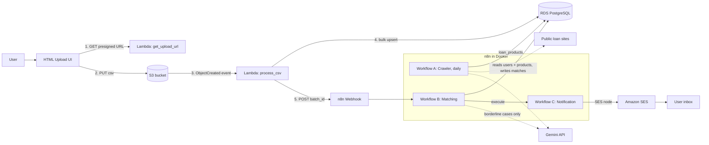

# Loan Eligibility Engine: Scope Document

**Goal:** Build, deploy and demo an automated pipeline: CSV upload → AWS ingestion → n8n crawling, matching, notification, using free-tier services only. **Timeline:** 3 days. **Deliverables:** repo, serverless.yml, docker-compose.yml, 3 n8n JSONs, README, 5-10 min video.

---

## 1. Problem statement (plain English)

A lending platform has many users and many personal loan products. We need a system that:

1. Takes a bulk CSV of users and stores it safely.
2. Finds current personal loan products from public websites.
3. Works out which users likely qualify for which products, cheaply and fast.
4. Emails each user their matches.

The assignment tests three skills: event-driven AWS design, n8n workflow automation, and smart optimization (not throwing everything at an LLM).

---

## 2. In scope vs out of scope

**In scope**

- CSV upload UI, S3 presigned upload, Lambda parsing, RDS storage
- Three n8n workflows (A crawler, B matcher, C notifier)
- Multi-stage filtering ("Optimization Treasure Hunt")
- SES emails, README with diagram, demo video

**Out of scope (do not spend time here)**

- User login/authentication for the UI
- A fancy frontend framework
- Real credit decisions or compliance logic
- Production-grade VPC networking, multi-region, CI/CD
- Perfect crawling of every bank site

---

## 3. Free-tier tech stack

| Layer | Choice | Why / free-tier note |
| --- | --- | --- |
| Language | Python 3.12 | Simple, good libraries (psycopg2, boto3) |
| IaC | Serverless Framework | Required by the assignment; free for individuals |
| Upload storage | Amazon S3 | Free tier storage and requests; CSV lands here |
| Compute | AWS Lambda | 1M requests/month free |
| Upload URL endpoint | Lambda Function URL (or API Gateway, optional) | Function URL is free and simpler. API Gateway is optional per the brief |
| Database | RDS PostgreSQL, db.t3.micro or t4g.micro, 20 GB | Free tier. Check your account type (older accounts: 12-month free tier; newer accounts: credit-based plan). Stop or delete it after the demo |
| Email | Amazon SES | Starts in **sandbox**: you must verify the sender and every recipient email. Fine for the demo |
| Workflow engine | n8n, self-hosted via Docker Compose | Free community edition, runs on your laptop |
| Public access to n8n | Cloudflare Tunnel or ngrok (free) | Lambda must reach n8n's webhook. Laptop is not public, so a tunnel is needed |
| LLM | Gemini Flash family via Google AI Studio free key | Free tier with rate limits. Keep calls few and batched |
| Frontend | One static HTML + vanilla JS file | Open locally, or host on S3 static site (free) |
| Repo | Private GitHub | Invite [saurabh@clickpe.ai](mailto:saurabh@clickpe.ai) and [harsh.srivastav@clickpe.ai](mailto:harsh.srivastav@clickpe.ai) |
| Diagram | Mermaid in README | Renders on GitHub, no tool needed |

**Cost guardrails:** set an AWS Budget alert at $1, use only one region (e.g. ap-south-1 or us-east-1), delete the RDS instance and S3 files after submission.

---

## 4. Architecture



**Why this pattern:** the browser uploads straight to S3 via a presigned URL, so file size never touches Lambda or API Gateway limits. The S3 event makes ingestion asynchronous and scalable.

---

## 5. Component-by-component scope

### 5.1 Data ingestion (AWS)

**Lambda `get_upload_url`**

- Returns a presigned PUT URL for `uploads/<timestamp>-<uuid>.csv`, valid \~5 minutes
- Restricts content type to `text/csv`
- Returns CORS headers so the browser can call it

**S3 bucket**

- CORS allows PUT from the UI origin
- Block public access ON; only presigned URLs can write
- Optional lifecycle rule to delete uploads after 7 days

**Lambda `process_csv`** (trigger: S3 ObjectCreated, prefix `uploads/`)

- Streams the file line by line (no loading it all in memory)
- Expected columns: `user_id, email, monthly_income, credit_score, employment_status, age`
- Validation: required fields present, email format, numeric fields numeric, credit score in 300-900 range, age 18-100. Invalid rows are counted and written to a `rejected/` file in S3, not fatal
- Normalises `employment_status` (lowercase, trimmed, mapped to: salaried, self_employed, unemployed, student, other)
- Inserts in batches of \~1,000 using `execute_values` with `ON CONFLICT (user_id) DO UPDATE` (idempotent: re-upload does not duplicate)
- Stamps every row with `upload_batch_id`
- Records the batch in an `upload_batches` table (batch_id, filename, total, inserted, rejected, status, created_at)
- On success, POSTs `{batch_id, user_count}` to the n8n webhook with a shared-secret header, with 3 retries and timeout
- Timeout 5 min, memory 512 MB. Failures go to a dead-letter queue (SQS, free tier) or CloudWatch log alarm

**Connectivity decision:** Lambdas run **outside a VPC** and connect to a publicly accessible RDS (avoids NAT Gateway cost, which is not free). Mitigate with a strong password, SSL enforced (`sslmode=require`), and credentials in env vars or SSM Parameter Store (free standard tier). Document this as a conscious trade-off in the README.

### 5.2 Database schema

- `upload_batches` as above
- `users`: user_id (PK), email, monthly_income, credit_score, employment_status, age, upload_batch_id, created_at
- `loan_products`: id (PK), provider, product_name, interest_rate_min, interest_rate_max, min_income, min_credit_score, max_credit_score, min_age, max_age, employment_required (text array), eligibility_notes (raw text), source_url, last_seen_at, is_active; UNIQUE(provider, product_name)
- `matches`: id, user_id, product_id, batch_id, match_stage (sql / rules / llm), score, reason, notified (bool, default false), created_at; UNIQUE(user_id, product_id)
- `crawl_runs`: run_id, source_url, status, products_found, error, created_at (for monitoring and debugging)
- Indexes: users(upload_batch_id), users(credit_score, monthly_income), matches(notified), loan_products(is_active)

### 5.3 n8n setup

- `docker-compose.yml` with the n8n image, port 5678, a persistent volume, timezone set, `N8N_ENCRYPTION_KEY`, basic auth on, `WEBHOOK_URL` set to the tunnel URL
- Credentials created in n8n UI: Postgres (RDS host/port/db/user/password, SSL on), AWS (access key for SES only, least-privilege IAM user), Gemini/OpenAI API key, Header Auth for the webhook secret
- Workflow JSONs exported to `/n8n/workflows/` with **no secrets** inside

### 5.4 Workflow A: Loan Product Discovery

- **Trigger:** Schedule (daily) plus manual trigger for the demo
- **Sources:** 2-3 public sites, kept in a Set/Code node as a list (e.g. a comparison site like BankBazaar or Paisabazaar, plus one or two bank pages like SBI or HDFC personal loan pages; pick pages that are reachable via plain HTTP; adjust to the user's country)
- **Flow:** Split In Batches → HTTP Request (with browser-like User-Agent, timeout, retry on fail) → HTML node / Code node strips scripts, styles and nav, keeping the main text → Gemini node extracts JSON using a fixed schema → Code node validates and normalises the JSON → Postgres upsert (ON CONFLICT provider+product_name) → write `crawl_runs` row
- **Robustness to layout changes:** because extraction is LLM-on-text, not CSS selectors, layout changes do not break it. Add: JSON schema validation, ignore products with missing core fields, mark products not seen in 7 days `is_active = false`, retry once on bad JSON
- **Error handling:** per-site error branch so one failing site does not stop the others; error logged to `crawl_runs`
- **Fallback:** keep a small seed `loan_products` set (SQL file) so the demo works even if a site blocks you
- **Etiquette:** check robots.txt and terms, crawl once a day, low volume

### 5.5 Workflow B: User-Loan Matching (with the Optimization Treasure Hunt)

- **Trigger:** Webhook (POST, header-auth). Responds 200 immediately, processes after
- **Input:** `batch_id`

**Multi-stage pipeline**

| Stage | Where | What it does | Cost |
| --- | --- | --- | --- |
| 0. Scope | SQL | Only users with `upload_batch_id = batch_id`, only `is_active` products. Skip pairs already in `matches` | Free |
| 1. SQL pre-filter | Postgres | One set-based JOIN: income ≥ min_income, credit score within range, age within range. Cuts the large majority of the user × product pairs (e.g. 10,000 × 30 = 300,000 pairs down to a small fraction) | Free, ms |
| 2. Rules and scoring | n8n Code node | Checks employment type against `employment_required`, computes a score (headroom on income and credit score), classifies each pair: **clear match**, **borderline**, or **reject** | Free |
| 3. LLM check | Gemini, only for borderline | Borderline = free-text eligibility notes the rules cannot parse, or values within \~5% of a threshold. Pairs are **batched** (e.g. 20 per call), response is strict JSON `{user_id, product_id, eligible, reason}`. Hard cap on calls per run and a cache keyed on (product, profile bucket) | Tiny |
| 4. Persist | Postgres | Bulk insert into `matches` with stage, score and reason. ON CONFLICT DO NOTHING | Free |

- **Result:** the LLM sees maybe 1-5% of pairs instead of 100%. README must show this reduction with real numbers from your run (pairs at each stage).
- **Finish:** calls Workflow C (Execute Workflow node or webhook), passing `batch_id`
- **Error handling:** Error Trigger workflow or error branch that logs failures and marks the batch `failed`

### 5.6 Workflow C: User Notification

- **Trigger:** called by Workflow B (Execute Workflow / webhook), with a manual trigger for testing
- **Flow:** Postgres query: matches where `notified = false` and batch = input, joined with user and product, grouped per user → Code node builds a personalized HTML + plain-text email (name from email, list of products with interest rate and why they matched, top matches first, max \~5) → AWS SES node sends → on success, update `notified = true` → on failure, leave false and log
- **Rate limiting:** Split In Batches with a short wait to respect SES sandbox rate limits (1 email/sec)
- **Idempotency:** the `notified` flag guarantees no duplicate emails if re-run
- **Demo constraint:** SES sandbox only delivers to verified addresses, so the demo CSV should include 2-3 rows with your own verified emails

### 5.7 Minimal UI

- Single `index.html`: file picker, CSV-only check, Upload button, progress/status text, and a success message with the batch id
- Flow: fetch presigned URL → PUT file to S3 → show "Uploaded, processing started"
- No framework, under \~100 lines

---

## 6. Security checklist

- No secrets in Git (`.env.example` only, `.gitignore` for real `.env`)
- S3 bucket private; short-lived presigned URLs
- IAM roles scoped to: the one bucket, SSM params, and CloudWatch logs; separate IAM user for n8n with only `ses:SendEmail`
- Webhook protected by a shared-secret header
- RDS SSL required, strong password, security group documented
- n8n basic auth enabled, encryption key set
- Avoid logging email addresses or full user rows

---

## 7. Three-day plan

**Day 1: AWS side**

- AWS account, budget alert, region choice, create RDS, run schema.sql
- Write `serverless.yml`, both Lambdas, S3 CORS, UI
- Test: upload the provided user CSV, confirm rows in RDS
- Verify SES sender email and your test recipient emails (start early, can take time)
- Push to private GitHub, invite collaborators

**Day 2: n8n core**

- docker-compose, tunnel, credentials
- Workflow A: crawl one site, then add the others, store products
- Workflow B: webhook, SQL pre-filter, rules, LLM stage, matches table
- Wire Lambda → webhook end to end

**Day 3: finish and present**

- Workflow C and SES end-to-end test
- Error handling, idempotency re-test (upload same file twice)
- README: diagram, setup steps, credentials, design decisions, funnel numbers
- Export workflow JSONs, clean secrets
- Record video, final repo check

*Buffer rule: if behind schedule, cut polish (UI styling, third crawl site), never cut the end-to-end flow.*

---

## 8. Repository structure

```
loan-eligibility-engine/
├── serverless.yml
├── docker-compose.yml
├── .env.example
├── README.md
├── sql/
│   ├── schema.sql
│   └── seed_loan_products.sql
├── src/
│   ├── get_upload_url.py
│   ├── process_csv.py
│   └── common/ (db.py, validators.py, n8n_client.py)
├── frontend/index.html
├── n8n/workflows/
│   ├── A_loan_product_discovery.json
│   ├── B_user_loan_matching.json
│   └── C_user_notification.json
├── data/sample_users.csv
└── docs/ (architecture diagram, screenshots)
```

---

## 9. README must contain

1. Overview and architecture diagram
2. Prerequisites (AWS account, Docker, Node, Serverless, Python, tunnel tool)
3. AWS setup: RDS, schema, SES verification, `serverless deploy`
4. n8n setup: docker compose, tunnel, importing workflows, creating each credential (Postgres, AWS, Gemini, webhook secret)
5. How to run the pipeline end to end
6. Design decisions: event-driven ingestion, LLM-based crawling, **Optimization Treasure Hunt with funnel numbers**, idempotency, cost choices
7. Known limitations and future improvements

---

## 10. Video plan (5-10 min)

1. (1 min) Problem and architecture diagram
2. (2 min) Code walkthrough: serverless.yml, Lambdas
3. (3 min) n8n walkthrough, node by node, A then B then C, stressing the filtering funnel
4. (3 min) **Live demo:** upload CSV in the UI → show S3 object and RDS rows → show Workflow B executing → show matches table → show Workflow C
5. (1 min) Show the **received email** in the inbox

---

## 11. Acceptance criteria (definition of done)

- [ ] Uploading a CSV through the UI results in rows in `users` without manual steps
- [ ] Re-uploading the same CSV creates no duplicates
- [ ] Workflow A populates `loan_products` from at least 2 sites
- [ ] Workflow B is triggered automatically and fills `matches`
- [ ] The LLM is called only for borderline pairs; funnel numbers documented
- [ ] Workflow C sends real emails via SES and sets `notified = true`
- [ ] A bad row in the CSV does not crash the pipeline
- [ ] `serverless deploy` and `docker compose up` work from a clean clone using the README
- [ ] No secrets committed; collaborators invited
- [ ] Video shows everything listed in section 10

---

## 12. Risks and mitigations

| Risk | Mitigation |
| --- | --- |
| SES sandbox blocks sending | Verify your own emails on Day 1; mention production access request in README |
| Lambda cannot reach n8n on laptop | Cloudflare Tunnel/ngrok; set `WEBHOOK_URL`; keep tunnel running in demo |
| Crawl blocked or JS-rendered page | Pick static-friendly pages, fallback seed data |
| Gemini rate limits | Batch calls, cap per run, cache, retry with wait |
| Gemini returns invalid JSON | Strict schema, validation, one retry, then skip |
| RDS free tier unavailable or costs | Budget alert; stop instance after demo |
| Lambda psycopg2 packaging issues | Use `serverless-python-requirements` with Docker, or psycopg2-binary layer |
| Running out of time | Priority order: ingestion → B → C → A polish → docs |

---

## 13. Open questions to settle before building

1. Which country/market for loan sites (affects site choice and currency)?
2. Which AWS region and does your account have the classic or credit-based free tier?
3. Gemini or OpenAI key available?
4. Which verified email addresses will receive the demo emails?
5. Do you prefer Cloudflare Tunnel or ngrok?